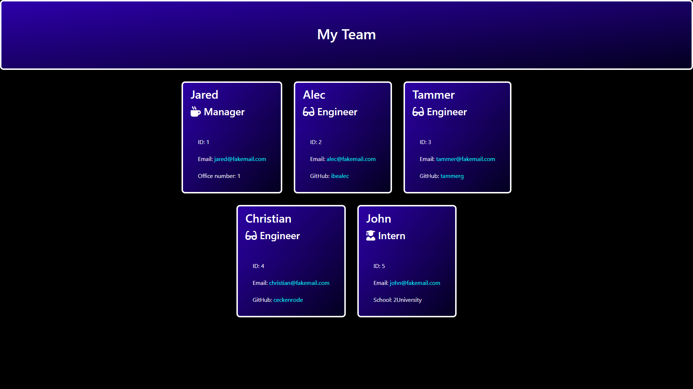

# team-profile-generator

For this project, the task was to create a command-line JavaScript program that uses the Inquirer and FS modules to create a HTML file from user input.
The scenario is that a person working on a tech team may want to keep track of certain details of team members such as role, name, or email.
The available roles are Manager, Engineer and Intern. It also includes role-specific details such as manager office number, engineer github profile, or intern school.

Each of the roles are represented as objects that descend from an Employee class. Each newly created member is stored in an array that is then fed into a HTMLRenderer module. This module inserts data from the objects into template HTML files, and then adds those role-specific HTML files with the included customised data into an overall team profile HTML page. THe FS module is then used to make a file from this.

The `HTMLRenderer module`, along with the `Main, Manager, Engineer, and Intern .html` template files were provided to me as-is, with the exception of the addition of custom `<style>` within `main.html` for portability.

The `Employee, manager, Engineer, and Intern .js` files were filled in by me in accordance with the provided `test` files, as was the function content of `app.js`.

The resulting html file is saved into the `output` folder as `team.html`. If the output folder does not exist when run, it is created.

## Examples
A demonstration of the application's command line interface is below:

The following is an example of the resulting `team.html` file as viewed in a browser:

